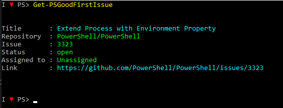

[](https://ci.appveyor.com/project/tomlarse/get-psgoodfirstissue/branch/master)

# Get-PSGoodFirstIssue



## SYNOPSIS
Gets a random issue from github.com/Powershell/Powershell labeled `Up-for-grabs`

## SYNTAX

```
Get-PSGoodFirstIssue [[-OauthToken] <Object>] [[-Repo] <Object>] [[-Labels] <Object>] [<CommonParameters>]
```

## DESCRIPTION
Gets a random issue from github.com/Powershell/Powershell labeled `Up-for-grabs`

## EXAMPLES

### Example 1
```powershell
PS C:\> Get-PSGoodFirstIssue
```

Gets a random issue labeled `up-for-grabs` from the powershell/powershell repo.

### Example 2
```powershell
PS C:\> Get-PSGoodFirstIssue -Repo "Powershell/vscode-powershell"
```

Gets a random issue labeled `up-for-grabs` from the powershell/vscode-powershell repo.

### Example 2
```powershell
PS C:\> Get-PSGoodFirstIssue -Repo "Powershell/vscode-powershell" -Labels "Issue-bug"
```

Gets a random issue labeled `Issue-bug` from the powershell/vscode-powershell repo.

### Example 3
```powershell
PS C:\> $iss = Get-PSGoodFirstIssue
PS C:\> $iss | Select-Object -Property *
```
Will list all available properties, not just the pretty synopsis.

## PARAMETERS

### -Labels
Label to get a random issue from. Per the github api spec it should be possible with a comma separated list, but it does not currently work.

```yaml
Type: Object
Parameter Sets: (All)
Aliases:

Required: False
Position: 2
Default value: None
Accept pipeline input: False
Accept wildcard characters: False
```

### -OauthToken
After 60 calls to the API in an hour, github will block you. Use an oAuth token from (https://github.com/settings/tokens) to authenticate in that case

```yaml
Type: Object
Parameter Sets: (All)
Aliases:

Required: False
Position: 0
Default value: None
Accept pipeline input: False
Accept wildcard characters: False
```

### -Repo
The repo to search in. Use `owner/repo` format.

```yaml
Type: Object
Parameter Sets: (All)
Aliases:

Required: False
Position: 1
Default value: None
Accept pipeline input: False
Accept wildcard characters: False
```

### CommonParameters
This cmdlet supports the common parameters: -Debug, -ErrorAction, -ErrorVariable, -InformationAction, -InformationVariable, -OutVariable, -OutBuffer, -PipelineVariable, -Verbose, -WarningAction, and -WarningVariable.
For more information, see about_CommonParameters (http://go.microsoft.com/fwlink/?LinkID=113216).

## INPUTS

### None

## OUTPUTS

### System.Management.Automation.PSCustomObject
## NOTES

## RELATED LINKS